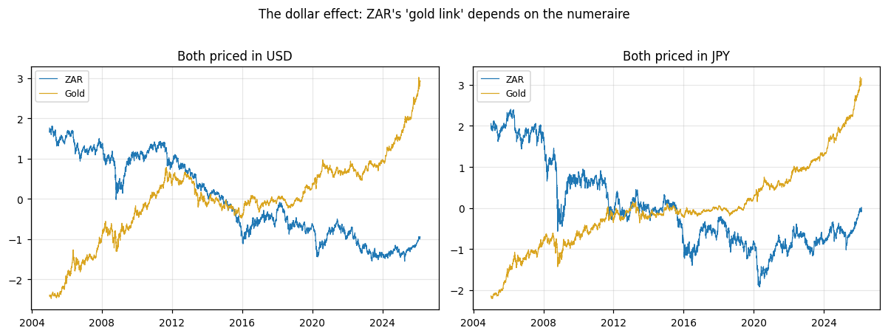
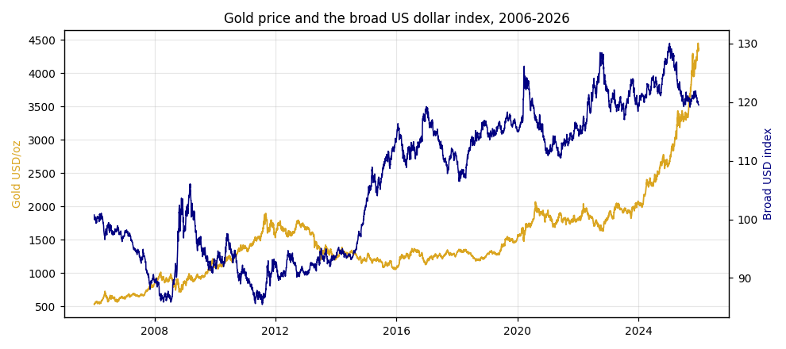
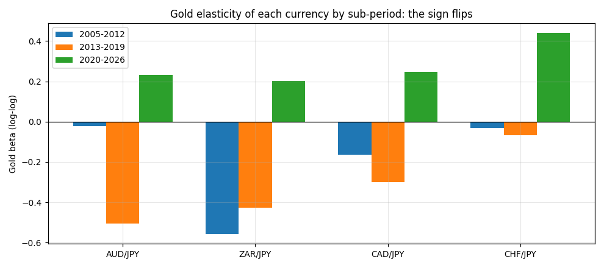
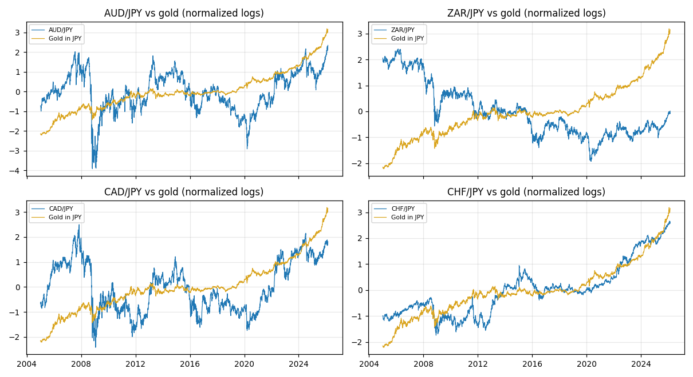
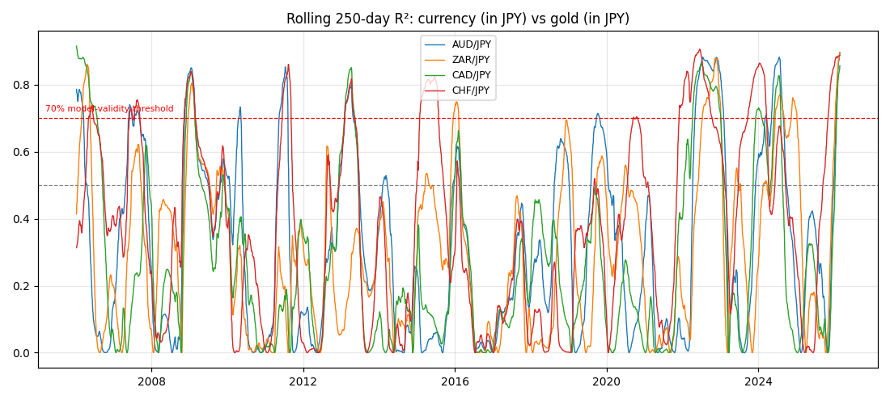
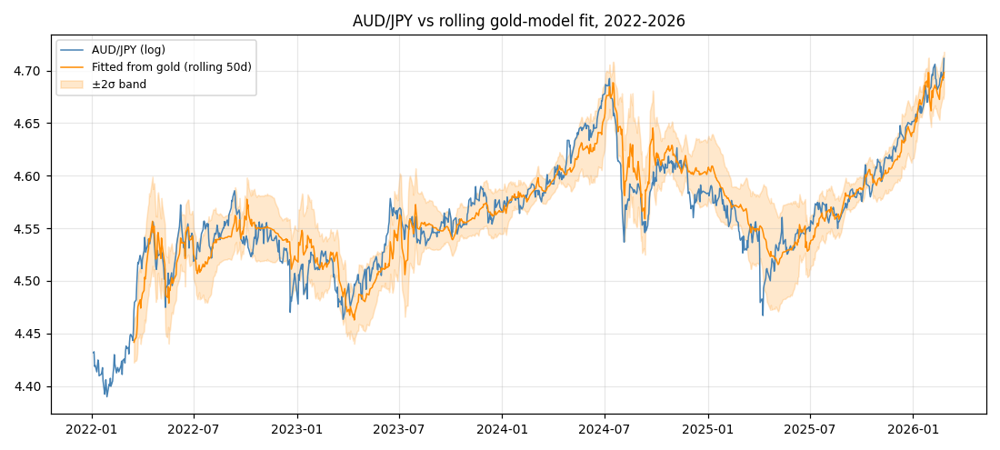
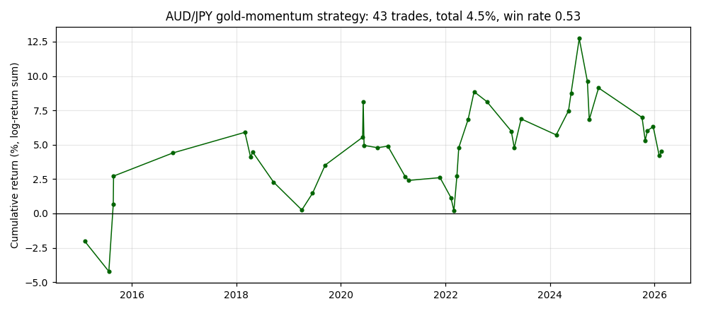
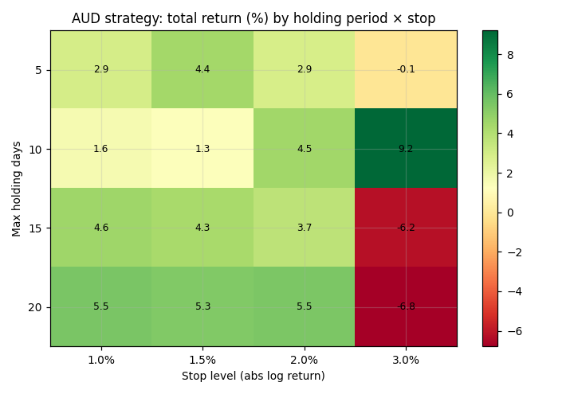

# GOLD MONEY
### Global FX & Commodities Research

**When do gold prices matter for exchange rates? Evidence from 21 years of daily data**

| | |
|---|---|
| **Research by** | Maitrayee Anand Vishnu |
| **Date** | July 2026 |
| **Asset classes** | Gold (XAU), G10 & EM FX |
| **Coverage** | AUD, ZAR, CAD, CHF vs. gold (JPY, EUR, CHF and basket numeraires) |
| **Sample** | Daily, 4 Jan 2005 to 25 Feb 2026 (5,146 obs.) |

**Full research report:** [paper/Gold-Prices-vs-Exchange-Rate_Maitrayee_Anand_Vishnu.pdf](paper/Gold-Prices-vs-Exchange-Rate_Maitrayee_Anand_Vishnu.pdf)

---

## Key takeaways

- **The Australian dollar is the one real gold currency here, and its link to gold holds up under pressure.** Since 2020, daily gold moves and daily AUD moves travel together no matter which currency we price them in, yen, euro, franc, or a four-currency basket, and gold keeps its punch even after we control for the dollar and market fear. No other currency in the study clears that bar.
- **Be careful how you quote the headline.** Gold "explaining 63% of AUD" is the flashy version, and it is the fragile one: it comes from price levels measured in yen, and part of it is just the yen falling apart in 2022-24. Price the same thing in euros and it fades; the day-to-day relationship, by contrast, holds everywhere. Levels flatter the story. Returns carry it.
- **South Africa's gold-currency reputation does not survive the tests.** Put the dollar and volatility into the regression and the rand's gold coefficient turns negative in every measuring currency. The rand trades on the dollar and global risk appetite, not on gold.
- **The relationship has no permanent anchor.** Cointegration tests find nothing pulling gold and these currencies back together, so when they drift apart they can stay apart for years. And a formal break search does not endorse a clean "2020" regime, the biggest breaks land in 2008 and 2011. The 2020s split in the tables is a convenient description, not a statistical fact, and it is labeled that way.
- **It is real, but it is not a trade.** The AUD strategy makes 4.5% before costs over 11.5 years, a Sharpe of 0.10 and a 10% drawdown, and realistic trading costs would eat most of what is left.

---

## Summary assessment

| Currency | Levels link, 2020-26 (JPY) | Returns link, 2020-26 (all numeraires) | Survives controls? | Verdict |
|---|---|---|---|---|
| **AUD** | Strong (R² 0.63) | **Positive, significant in all four** | **Yes, in 3 of 4 numeraires** | The genuine article, but only lately |
| **ZAR** | Strong (R² 0.56) | Positive (common global factor) | **No, negative in all four** | A dollar and risk currency in disguise |
| **CAD** | Strong (R² 0.60) | Positive | Yes (JPY: β 0.11, t 5.2) | A minor, quieter gold link |
| **CHF** | Strongest (R² 0.86) | Positive | Yes (JPY terms) | The trap, a safe-haven twin with no mines |

*The franc is the cautionary tale of the whole project: the strongest gold correlation in the sample belongs to a country that mines no gold. Correlation is not geology.*

---

## Where this sits in the literature

The pieces are familiar. Chen and Rogoff (2003) built the commodity-currency framework; Sjaastad and Scacciavillani (1996) tied gold to exchange rates; Apergis (2014) looked at gold and the Australian dollar directly; Erb and Harvey (2013) punctured a lot of the mythology around what gold actually does. What this project adds is threefold. It prices gold and the currencies in several non-dollar numeraires, so you can see how much of the "gold link" is really just the dollar hiding in both series. It uses rolling-window and formal break tests instead of assuming the relationship sits still. And it finishes with a trading test, so a statistically significant result has to prove it is worth something before it gets to call itself real.

---

## 1. The question, and how to test it fairly

The market shorthand is that the Australian dollar and the South African rand are leveraged bets on gold, because gold is a big part of what they export. It is a reasonable-sounding claim that gets repeated far more often than it gets checked. This is the check.

Gold makes an awkward test case, because it is not just a commodity, it is money-adjacent. Its price answers to US real interest rates, the strength of the dollar, and how frightened the world feels, which happen to be the same forces that push commodity currencies around. So a raw correlation between gold and the Aussie is really three stories tangled together:

1. **The income story.** Dearer gold means a gold exporter earns more, so its currency should firm. This is the one the market assumes.
2. **The dollar story.** Gold is priced in dollars, so a softer dollar lifts the dollar-price of gold and most currencies at once, mechanically.
3. **The fear story.** Risk-off episodes move gold and currencies together with no real link between them at all.

### Why these four currencies

Each one is in the study to do a specific job:

| Currency | Role | Why it earns a seat |
|---|---|---|
| **AUD** | Primary candidate | Top-three producer, gold near the top of the export list, currency floats freely. If anything is a gold currency, it is this. |
| **ZAR** | Historic candidate | The original gold currency, but the mines have been shrinking for twenty years, so it tests whether the label outlives the industry. |
| **CAD** | Control | Canada mines plenty of gold yet exports oil, cars and metals too. If the loonie tracks gold as tightly as the Aussie, the link is probably global, not mining. |
| **CHF** | The trap | Switzerland mines no gold, but the franc and gold both catch safe-haven flows. However strong its "gold link" looks, that is the size of the false positive we need to watch for. |

The other big producers are out for good reasons: China consumes its own gold and manages the yuan; Russia is sanctioned; Uzbekistan and the large West African producers run pegged or managed rates, and a peg cannot pass a gold signal through. Peru and Ghana are fair game and are flagged for a follow-up.

### The measuring-stick problem, stated plainly

Here is the trap almost everyone falls into. Gold is priced in dollars, so if you test the Aussie against gold and measure both in dollars, the dollar is sitting inside both numbers and it manufactures a correlation out of thin air. Section 2 shows this happening to the rand in living colour.

So the main analysis measures everything in Japanese yen, Japan mines almost no gold and the yen floats freely and trades deeply. That is the cleanest single yardstick available, but it is not perfect: the yen has a life of its own (Bank of Japan policy, carry trades, safe-haven flows), and it was one of the weakest major currencies of 2022-24, which quietly trends every yen-priced series upward together. Pricing in yen greatly reduces the dollar contamination; it does not erase measuring-stick effects entirely. That is exactly why every headline result is re-run in the euro, the franc, and a four-currency basket (Section 4), and why the conclusions lean only on what survives all of them.

---

## 2. The dollar effect

This is the most important chart in the project. In dollars, the rand looks powerfully tied to gold, with the wrong sign (β −0.57, R² 0.53). Re-price it in yen and the drama collapses into two long trends passing each other in the night: gold climbing, the rand sliding.



Every gold-currency chart drawn in dollars inherits this illusion. It is probably the single most common mistake in the published commentary.



---

## 3. The relationship, era by era (a description, not a verdict)

The split below is hand-chosen and uses price levels, so read it as a picture of how the relationship drifts, not as proof of anything. The formal test is in Section 4.

| Period | AUD gold β | t | R² |
|---|---|---|---|
| 2005-2012 | −0.02 | −1.3 | 0.00 |
| 2013-2019 | −0.51 | −3.2 | 0.11 |
| 2020-2026 | +0.23 | 11.0 | 0.63 |

In yen terms, gold accounts for 63% of the variation in AUD across 2020-26. Two things to keep in mind before you fall in love with that number. It comes from a regression on trending, non-stationary prices with no long-run anchor behind them (Section 5), so it describes co-trending in one era, not an equilibrium. And, as Section 4 shows, it is specific to the yen. The claim that actually holds up rests on the returns-based and multi-numeraire results, not on this R².

Add the broad dollar and the VIX as controls (2006-2025, yen terms) and the gold coefficient lands at +0.16 for AUD (t 12.2), +0.11 for CAD (t 5.2), +0.31 for CHF (t 24.1), and −0.15 for ZAR (t −3.3). The rand's apparent gold link is swallowed whole by the dollar (dollar β −1.22).





---

## 4. Robustness: does the answer depend on the measuring stick, and is 2020 real?

**Change the yardstick.** The AUD result re-estimated in four numeraires:

| AUD vs gold | JPY | EUR | CHF | Basket |
|---|---|---|---|---|
| Levels β, 2020-26 | +0.23 (t 11.0) | −0.11 (t −7.2) | −0.32 (t −11.4) | −0.08 (t −2.7) |
| **Returns β, 2020-26** | **+0.25 (t 7.9)** | **+0.10 (t 6.0)** | **+0.12 (t 5.2)** | **+0.43 (t 13.8)** |
| Controls β (full sample) | +0.16 (t 12.2) | +0.14 (t 7.7) | −0.17 (t −9.8) | +0.13 (t 8.9) |

Read the top two rows together and the lesson is unmistakable. The *levels* link is a chameleon, strongly positive only in yen, partly because the weak yen of 2022-24 dragged AUD/JPY and gold/JPY up in tandem. The *returns* link is positive and significant in every single numeraire, and the controls survive in three of four (the franc is the expected exception, measure against the franc and you subtract the very safe-haven factor gold shares). So the honest, durable claim is a returns claim: day to day, gold and the Aussie move together in this era, whatever you price them in.

The rand needs no such nuance. With controls, its gold coefficient is negative in all four numeraires (−0.15 yen, −0.22 euro, −0.59 franc, −0.24 basket). Not a gold currency, any way you slice it.

**Is 2020 a real break?** A Quandt-Andrews sup-F search over every candidate date (15% trimming) says no. The dominant break for AUD sits in September 2008 in levels and May 2011 in returns; the rand breaks in late 2015, the franc in April 2013. Two honest conclusions: the relationship is unstable everywhere, and the 2020 split in Section 3 is a readable label for the recent era, not a date the data picked. A multi-break Bai-Perron pass is the obvious next step.

---

## 5. The long run, and who leads whom

**No anchor.** Engle-Granger finds no cointegration for any of the four (AUD closest at p = 0.07; ZAR nowhere at p = 0.88), and Johansen agrees, selecting rank 0 in every {FX, gold, dollar} system. Where an adjustment speed can be pinned down at all, half a gap takes 190-350 trading days to close, far too slow to lean on.

**Who carries information about whom?** Granger tests ask whether yesterday's gold returns help forecast today's currency returns, and vice versa. That is predictive content, not proof of causation, and the distinction matters. The p-values below are the smallest across the five lags tested, which flatters borderline cases a little:

| Direction | AUD | ZAR | CAD | CHF |
|---|---|---|---|---|
| Gold → currency | **0.001** | 0.39 | **0.011** | 0.39 |
| Currency → gold | 0.06 | **0.004** | 0.27 | **0.007** |

For the producers (AUD, CAD), gold leads, news hits the gold market first and filters into the miners' currencies. For the risk currencies (ZAR, CHF), it runs the other way, because those currencies are mood rings for global risk, and the mood moves gold. The direction of the arrow is itself a way to classify a currency.

**Out-of-sample fit.** Using the same day's gold move, a gold model cuts forecast error (mean squared error) by 9-12% versus a coin-flip random walk, for all four currencies. That is same-day explanation, not a crystal ball.



The rolling chart is the honest one-picture summary: the link lives in bursts, above the 70% line only 7-16% of the time, 2008-09, 2011-13, 2022-26. Being a gold currency is something a currency does now and then, not something it is.

---

## 6. The trading test

The rule, kept deliberately simple: run a rolling 50-day regression of the currency on gold (both in yen); only trade when that model currently fits well (rolling R² ≥ 50%); enter when price breaks ±2σ out of the band, in the direction of the break; exit after 10 days or a 2% stop. Backtest August 2014 (after a 50-day warm-up on data from June 2014) to February 2026, before costs:

| Currency | Trades | Total return | Win rate |
|---|---|---|---|
| AUD | 43 | **+4.5%** | 53% |
| ZAR | 45 | −29.0% | 36% |
| CAD | 40 | −5.0% | 53% |
| CHF | 45 | −8.9% | 44% |

Run the AUD book's daily P&L through the usual desk metrics and the verdict is blunt: annualized return 0.4%, annualized vol 3.9%, **Sharpe 0.10**, maximum drawdown −9.9% over 11.5 years. Not investable as a fixed rule.





Three things keep the number honest. The tuned +9.2% you can squeeze from the grid is in-sample cherry-picking, and the cells next to it lose money. Returns are gross of costs, and at ~10bp of profit per trade, AUD/JPY spreads and slippage would take most of it. And these are sums of per-trade returns on flat position sizing, not a compounded portfolio. A real version would need a regime filter, trade only inside the high-fit clusters, and walk-forward validation. That is future work, and it is flagged as such.

---

## 7. What it all means

**If you invest:** don't read a gold chart as a currency forecast. The durable link is in daily returns, it is modest, and it mostly switches on in weak-dollar, high-fear windows. Watch the dollar and US real rates first, they sit behind both sides of the chart.

**If you set policy in a gold exporter:** a gold boom can genuinely firm the currency when the global backdrop cooperates, as Australia since 2020 shows. But there is no long-run anchor, and South Africa is a cautionary tale in how fast the label fades once the mines shrink. Treat a gold windfall like any commodity windfall, save some, hedge some, don't build the budget on it.

**If you research this next:** the direction-of-information test cleanly split producers from risk currencies, and it is cheap and repeatable. The obvious extensions: multi-break Bai-Perron dating, an SDR-style basket, interest-rate-differential and terms-of-trade controls, Peru and Ghana, and a walk-forward version of the trade.

## Limitations

- Controls stop at the broad dollar and the VIX. Rate differentials, terms of trade, oil (which matters for CAD), inflation surprises and current-account swings are left out, so some of the "gold effect" may be standing in for them.
- No daily real-rate (TIPS) series was available in the free data used.
- The break test is single-break (Quandt-Andrews); multi-break Bai-Perron, an SDR numeraire, and walk-forward strategy validation are all future work.
- The broad dollar index runs 2006 to Dec 2025; the daily gold fix mirror ends Feb 2026.
- The data mirrors refresh daily, to reproduce the exact numbers here, use the frozen files in `data/raw` rather than re-downloading.

---

## Reproduce

```bash
pip install -r requirements.txt
# To reproduce the exact numbers in this README, skip 01 and use the frozen data/raw files.
python scripts/01_download_data.py   # optional: pulls latest data (numbers will drift)
python scripts/02_build_panel.py     # builds data/processed/panel_daily.csv
python scripts/03_models.py          # writes results/model_results.json
python scripts/04_figures.py         # writes preview/*.png
python scripts/05_backtest.py        # writes results/backtest.json + figures
python scripts/07_robustness.py      # numeraire robustness, break tests, risk metrics
```

## Further reading

1. Chen Y, Rogoff K (2003), *Commodity Currencies.*
2. Sjaastad L, Scacciavillani F (1996), *The Price of Gold and the Exchange Rate.*
3. Apergis N (2014), *Can Gold Prices Forecast the Australian Dollar Movements?*
4. Erb C, Harvey C (2013), *The Golden Dilemma.*
5. Baur D, Lucey B (2010), *Is Gold a Hedge or a Safe Haven?*
6. Pukthuanthong K, Roll R (2011), *Gold and the Dollar (and the Euro, Pound, and Yen).*
7. Capie F, Mills T, Wood G (2005), *Gold as a Hedge Against the Dollar.*
8. Meese R, Rogoff K (1983), *Empirical Exchange Rate Models of the Seventies.*
9. O'Connor F, Lucey B, Batten J, Baur D (2015), *The Financial Economics of Gold, A Survey.*

---

## About the author

**Written by Maitrayee Anand Vishnu**

MS Finance candidate, Stevens Institute of Technology · Ex-FP&A Associate, JPMorgan Chase (CIB)

[LinkedIn](https://www.linkedin.com/in/maitrayee-vishnu) · [Portfolio](https://maitrayee196.github.io/Maitrayee_Portfolio/) · [GitHub](https://github.com/maitrayee196)

Questions, feedback, or ideas for extending the model? Open an issue or reach out.

---

*This repository is an independent research project produced for educational purposes. It is not investment research, an offer, or a recommendation to buy or sell any security or currency. Past backtested performance is not indicative of future results.*
